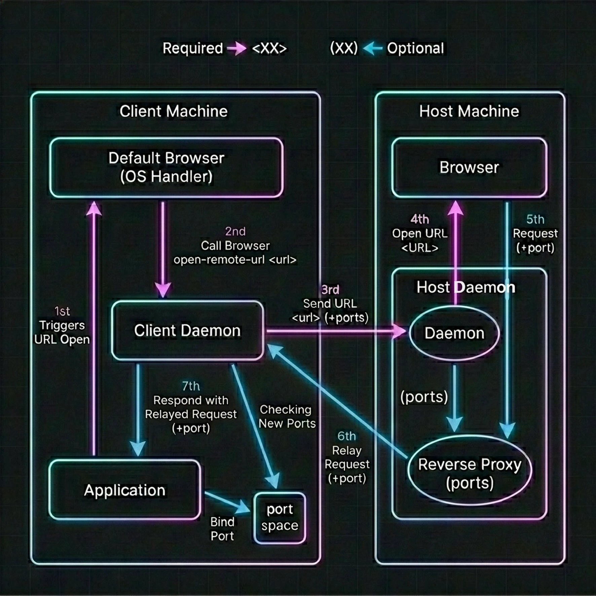

# Open Remote URL

[English](README.md) | [简体中文](README.zh_CN.md) | 日本語 (原文) | [日本語 (非技術者向け)](README.ja_EZ.md)

[](LICENSE)

> 💡 **プロジェクトの開発について**
> このプロジェクトの構想以外の全ては、AIモデル **Gemini 3.5 Flash** と **Claude Sonnet 4.6** によって開発されました。[詳細はプロジェクトの開発についてをご覧ください。](#プロジェクトの開発について)

> ⚠️ **現在の動作保証について**
> - **Linux版は現時点では未テストです。**
> - Windows版・macOS版では、URLの転送機能（ホストのブラウザでURLを開く）のみ動作確認済みです。リバースプロキシ機能（OAuthコールバック転送）は未検証です。
> - GitHub ActionsのCI/CDビルド時間の制限を回避するため、完成前にリポジトリをPublicに切り替えました。

Webサイトの表示やOAuthログイン認証を、別のデバイス（ホスト）のブラウザに転送して一元管理するシステム。

ローカルネットワーク内または仮想マシン上の**クライアント**マシンでのブラウザ起動をインターセプトし、URLを**ホスト**マシンへ転送して、ホスト側のブラウザを起動してWebサイトを表示します。

### 解決する課題・ニーズ

- **仮想マシン (VM) / Dockerコンテナ開発環境でのOAuthログインの苦痛を解消**
    - Dockerコンテナなどのブラウザ非搭載（またはクリーンな）環境で `wrangler login`、`supabase login` などのCLIコマンドを実行すると、ログイン用のブラウザを起動しようとします。通常はURLをコピーしてホストのブラウザで開く必要がありますが、ログイン完了後にブラウザから `http://localhost:8976/oauth/callback` などのローカルリダイレクトポートに対して行われるコールバックを受け取れず、ログインが途中で失敗します。
    - 本ツールは、クライアント環境でURLが開かれたことを検知してホストで表示するだけでなく、**URLが開かれたタイミングで割り当てられていたポート（15秒前の履歴）およびオープン後に新しく開いたポート（3秒後までチェック）を自動で検知し、ホストからクライアントへ一時的なリバースプロキシを自動で確立**します。これにより、ホストのブラウザで認証ボタンを押すだけで、コンテナ内の開発環境が自動でトークンを受信し、何事もなかったかのようにログインが成功します。

- **2PC（配信・ゲーム）環境でのブラウザセッション・認証情報の一元化**
    - ゲームPC（クライアント）でDiscordやSNSのリンクをクリックした際、普段使いのメインPC（ホスト）のブラウザ（ログイン情報、パスワードマネージャー、拡張機能が揃っている環境）で開くことができます。
    - サブPC側でログイン作業を繰り返す手間を削減し、セキュリティ面でもログイン情報をサブPC側に残さないため安全です。

### ※開発コンセプトについて

このプログラムは、開発者の「ゲーム用PCでアカウントにログインするとき、ログイン画面をメインPCで開きたい」という強いニーズから生まれました。このコンセプトや動作を破壊するようなプルリクエストは承認されません。

## 目次

- [動作原理](#動作原理)
- [環境設定](#環境設定)
    - [ホスト設定 (host/inactive.env)](#ホスト設定-hostinactiveenv)
    - [クライアント設定 (client/inactive.env)](#クライアント設定-clientinactiveenv)
- [インストール](#インストール)
- [ステータス確認](#ステータス確認)
- [アンインストール](#アンインストール)
- [プロジェクトの開発について](#プロジェクトの開発について)

---

## フローチャート



1. **URLのインターセプト**: クライアント上でURLが開かれた際のブラウザ起動要求をインターセプトします。
2. **URLの表示**: クライアントデーモンは、即座にURL情報のみをホストへ転送し、ホスト側のブラウザで開きます。
3. **ポート検出とプロキシ追加**: URLを開く15秒前までにクライアント側で割り当てられていたポート一覧を、ホストに送信します。ホスト側は自動的にそれらのポートに対する一時的なプロキシサーバーを立ち上げます。
4. **追加ポートの動的監視**: URLを開いた後、3秒間クライアント側を監視し、新しく追加されたポートがあればホスト側に追加でプロキシを立ち上げます。
5. **プロキシの自動削除**: クライアント側でプロキシ中のポートが閉じられた場合、ホストに対し即座に削除要求を送信し、不要になったプロキシサーバーを安全に破棄します（削除されなかったプロキシも、5分のタイムアウトで自動的に消去されます）。

---

## ダウンロード

[こちらから最新のリリースをダウンロード](https://github.com/NaeCqde/open-remote-url/releases/latest)

OSとアーキテクチャにあった.zipファイルをダウンロードしてください。

## 環境設定

設定は、システム環境変数および `.env` ファイルから読み込まれます。

### 設定ファイルの優先順位と読み込み場所

プログラム実行時、設定ファイル（`.env`）は以下の優先順位で探索・読み込まれます。

1. **OSごとの設定フォルダ**（インストール済みの場合はこちらから読み込まれます）
    - **Windows**: `%APPDATA%\open-remote-url\<client|host>\.env`
    - **macOS**: `/Users/<user>/Applications/OpenRemoteURLClient.app/.env`（または `OpenRemoteURLHost.app/.env`）
    - **Linux**: `~/.config/open-remote-url/<client|host>/.env`
2. **実行時のカレントディレクトリまたはその親ディレクトリ**
    - 上記の設定フォルダに `.env` が存在しない場合、プログラムを実行したディレクトリ（または親ディレクトリ）にある `.env` ファイルが読み込まれます（開発時や手動実行時に便利です）。

※システム環境変数と `.env` ファイルの両方で同じ項目が定義されている場合は、 **`.env` ファイルの内容が優先（上書き）されます**。

### インストール時の動作

配布パッケージにはテンプレートとして `inactive.env` が同梱されています。
インストールスクリプトを実行すると、インストール用フォルダ内にある `inactive.env` が上記「OSごとの設定フォルダ」へ `.env` として自動的にコピーされます。

- **インストールの実行前に**、パッケージフォルダ内にある `inactive.env` をテキストエディタで開き、環境に合わせて設定値をあらかじめ書き換えて保存しておいてください。
- もし `inactive.env` が存在しない状態でインストールを実行した場合、デフォルトの設定値が記述された `.env` ファイルが設定フォルダ内に自動生成されます。

### ホスト設定 (`host/inactive.env`)

```env
LISTEN=0.0.0.0:40000
PASSPHRASE=some-shared-secret
```

| 変数 | 説明 | デフォルト |
|---|---|---|
| `LISTEN` | バインドアドレスとポート（`<host>:<port>` 形式） | `0.0.0.0:40000` |
| `PASSPHRASE` | 共通パスフレーズ。空欄の場合は認証なし。 | _(空)_ |

### クライアント設定 (`client/inactive.env`)

```env
LISTEN=0.0.0.0:30000
HOST_URL=http://<host_ip>:40000
RELAY_URL=http://<client_ip>:30000
PASSPHRASE=some-*shared*-secret:sunglasses:
```

| 変数 | 説明 | デフォルト |
|---|---|---|
| `LISTEN` | クライアントデーモンのバインドアドレスとポート（`<host>:<port>` 形式） | `0.0.0.0:30000` |
| `HOST_URL` | リモートホストデーモンのURL。`http://` と `https://`（rustls）に対応。 | `http://0.0.0.0:40000` |
| `RELAY_URL` | ホストがリバースプロキシのためにクライアントへ折り返す際のURL。ホスト側から到達可能なアドレスを指定（LAN IPやTailscale IP等）。こちらも`http://`と`https://`（rustls）に対応。 | `http://0.0.0.0:30000` |
| `PASSPHRASE` | ホストのパスフレーズと一致するキー。空欄の場合は認証なし。 | _(空)_ |

---

## インストール

本ツールはOSごとに以下の場所にインストールされ、OS起動時に自動でバックグラウンドデーモンが起動するように設定されます。

- **Windows**: `%LOCALAPPDATA%\Programs\open-remote-url\<client|host>\`
- **macOS**: `~/Applications/OpenRemoteURL<Client|Host>.app/`
- **Linux**: `~/.local/bin/open-remote-url/<client|host>/`

デーモンを登録・起動するには、以下の手順を行います：

- **Windows**: 実行ファイル（`open-remote-url-client.exe` または `open-remote-url-host.exe`）をダブルクリックしてGUIコントロールパネルを開き、**[Install Service]** ボタンをクリックします。
- **macOS**: アプリケーション本体（`OpenRemoteURLClient.app` または `OpenRemoteURLHost.app`）をダブルクリックしてGUIコントロールパネルを開き、**[Install Service]** ボタンをクリックします。
- **Linux**:
  - **デスクトップ環境（GUIあり）の場合**: 実行ファイル（`open-remote-url-client` または `open-remote-url-host`）をダブルクリックしてGUIコントロールパネルを開き、**[Install Service]** ボタンをクリックします。
  - **CUI/サーバー環境（GUIなし）の場合**: リリースフォルダ内にあるセットアップスクリプトを実行します: `./install.sh`

_インストール完了後、クライアント側OSの設定において、「デフォルトのWebブラウザ」として **Open Remote URL Client** を選択してください：_
- **Windows**: 設定 → アプリ → 既定のアプリ → Web ブラウザ
- **macOS**: システム設定 → デスクトップと Dock（または一般）→ デフォルトの Web ブラウザ → **Open Remote URL Client**
- **Linux**: `xdg-settings set default-web-browser open-remote-url-client.desktop`（またはデスクトップ環境の設定から変更）

---

## ステータス確認

アプリ（または実行ファイル）をダブルクリックすると、**GUIコントロールパネル**が開き、以下が確認できます：
- インストール状況（Installed / Not Installed）
- デーモン稼働状況（Running / Stopped） — インストールボタンを押した後に自動更新されます
- 実行ファイルのパスと設定ファイルのパス
- ボタン：**Install Service**（インストール）、**Uninstall Service**（アンインストール）、**Open Settings Folder**（設定フォルダを開く）

コマンドラインから直接実行することでも、簡易的にステータスを確認できます：

- **ホスト側**:

```bash
$ ./open-remote-url-host
Open Remote URL - Host Status

[Status]
- Installed:  Yes
- Running:    Yes
- Listen:     http://0.0.0.0:40000/
- Executable: /Users/<ユーザー名>/Applications/OpenRemoteURLHost.app/Contents/MacOS/open-remote-url-host
- Config:     /Users/<ユーザー名>/Applications/OpenRemoteURLHost.app/.env

[Usage]
- To install / start host:
  Double-click the OpenRemoteURLHost.app bundle (macOS) or the executable (Windows/Linux GUI) to open GUI Control Panel, or run `./install.sh` (Linux CLI)

- To uninstall / clean registrations:
  Open GUI Control Panel and click Uninstall, or run `./uninstall.sh` (Linux CLI)
```

- **クライアント側**:

```bash
$ ./open-remote-url-client
Open Remote URL - Client Status

[Status]
- Installed:  Yes
- Running:    Yes
- Listen:     http://0.0.0.0:30000/
- RELAY:      http://192.168.0.3:30000/
- HOST:       http://192.168.0.2:40000/
- Executable: /Users/<ユーザー名>/Applications/OpenRemoteURLClient.app/Contents/MacOS/open-remote-url-client
- Config:     /Users/<ユーザー名>/Applications/OpenRemoteURLClient.app/.env

[Usage]
- To install / start client:
  Double-click the OpenRemoteURLClient.app bundle (macOS) or the executable (Windows/Linux GUI) to open GUI Control Panel, or run `./install.sh` (Linux CLI)

- To uninstall / clean registrations:
  Open GUI Control Panel and click Uninstall, or run `./uninstall.sh` (Linux CLI)
```

---

## アンインストール

自動起動登録、ブラウザ関連付け、plist、systemdユーザーサービスなどの設定を完全に削除してバックグラウンドプロセスを終了するには、以下の手順を行います：

- **Windows**: 実行ファイルをダブルクリックしてGUIコントロールパネルを開き、**[Uninstall Service]** ボタンをクリックします。
- **macOS**: アプリケーション本体（`.app`）をダブルクリックしてGUIコントロールパネルを開き、**[Uninstall Service]** ボタンをクリックします。
- **Linux**:
  - **デスクトップ環境（GUIあり）の場合**: 実行ファイルをダブルクリックしてGUIコントロールパネルを開き、**[Uninstall Service]** ボタンをクリックします。
  - **CUI/サーバー環境（GUIなし）の場合**: リリースフォルダ内の `./uninstall.sh` を実行します。

---

## プロジェクトの開発について

このプロジェクトの構想以外の全ては、高度な設計・コーディング・構成能力を備えたAIモデル **Gemini 3.5 Flash** と **Claude Sonnet 4.6** によって開発および整理されました。

また、システム構成図（フローチャート）の画像は、iPadのフリーボードで描画した手書きのスケッチをベースに、**Gemini 3.1 Flash（マルチモーダル機能）** に読み込ませて文字を綺麗に清書し、枠の配置や全体のレイアウトを調整しながら作成されました（プロンプトの調整には試行錯誤が重ねられています）。

これらのAIモデルは、Googleが提供するAntigravityおよびAntigravity IDE上で無料で使用できます。
また、本プロジェクトはGoogle One AI Proプラン（月額約3,000円）とClaude Proプラン(月額約3,500円)を利用して完成しました。

- **開発開始（最初のプロンプト送信）**: 2026/05/26 15:35 JST
- **最終更新**: 2026/05/30 JST

なお、アニメの鑑賞と並行しながらのプロンプト入力・コード検証であったこと、そしてGeminiの応答が極めて高速であったことから、開発に専念していれば、本来はさらに短い時間で完成させることも可能でした。
